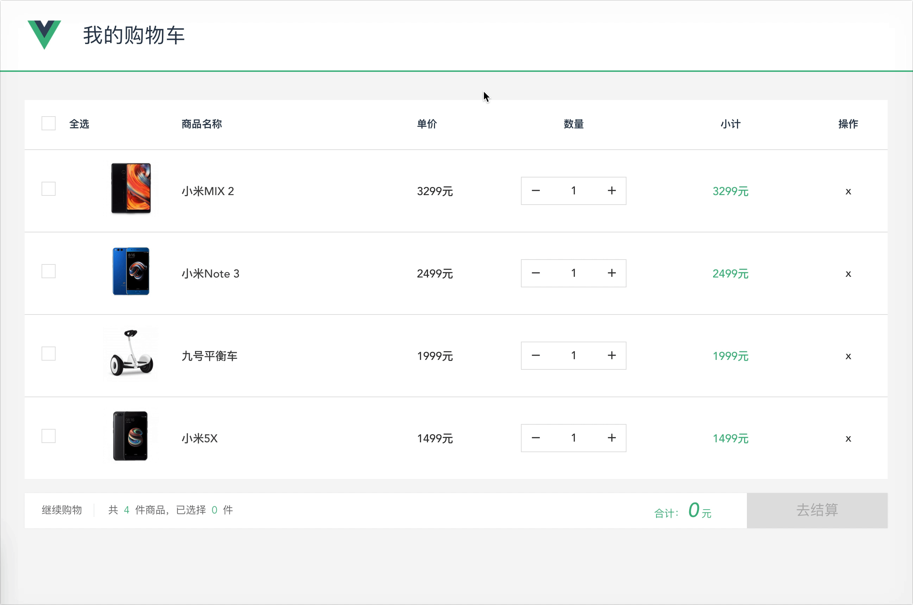

# vue-shopping-cart

[](https://github.com/xrr2016/vue-shopping-cart/issues) 



``` bash
# install dependencies
npm install

# serve with hot reload at localhost:8080
npm run dev

# start json-server
npm run json-server

# build for production with minification
npm run build

# build for production and view the bundle analyzer report
npm run build --report
```

License

MIT